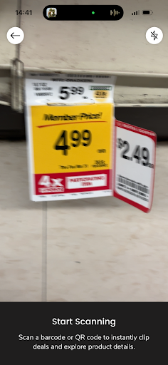
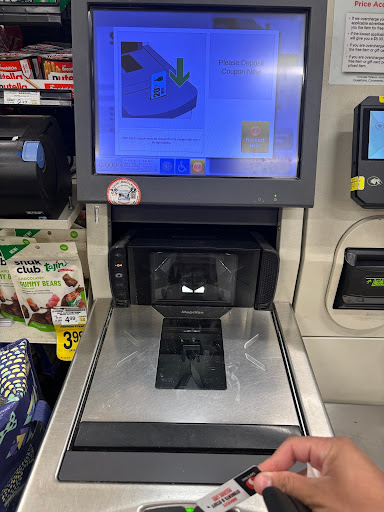

# Safeway Checkout & Coupons
As a near-campus Chico State student, I frequently shop at our local Safeway for groceries, it is a mostly seamless experience, but frequently do I experience technical annoyances when it comes to their self-checkout system. While the problems are small, they tend to add up.

I start off by entering Safeway, picking up all the groceries that I’m looking for. I go to the bakery aisle to pick up flour and see a barcode coupon, which is great! I open my Safeway app to scan it, and once I open the camera, it notifies me that the barcode scan has failed. Here, I expect that all I need to do is re-scan the code, which doesn’t work either. Eventually, it appears that I have to close and re-open the camera, and finally it works. As a whole, it appears that getting it right on the first scan is a matter of luck. Often it will scan quickly, but it’s not rare for it to take some time, which feels **inefficient** and **unsatisfying**.

(Side note, sorry I could not get a better picture. I believe the issue may have been fixed, as I was unable to replicate it as of now, but it was very frequent before).

Finally, after getting all my groceries, I begin to make my way to the self-checkout, and as I finish scanning my items, I press the pay button. Before I put my card in, I remember that I have my student coupon, but as I try to use it, there is no notification, no matter how much I keep trying my prices will not go down. It gets to the point where I need to restart my entire order, re-scanning everything just to use my coupon. I feel as if this lacks **affordance**, as there is no indication that I cannot use my coupon at this stage.

At last, I have scanned my groceries, and am currently scanning my coupon, expecting to see my prices decrease. Instead, I get a pop-up, telling me to drop my coupon in the machine in order to verify it. Obviously, I’m not going to drop my coupon into the machine, as it’s multi-use, so I feel as if the only way to remedy this is asking an employee. Doing this, I am recommended to use any other object and put it in the slot, such a scrap of coupon paper. After repeating this process repeatedly, it’s become an easy pattern, but the fact that the machine tells a shopper to discard their coupon seems to extremely lack error **prevention**, and in fact, encourages user error by telling them to discard their multi-use coupon, which I can only imagine the lengths one would need to go through to retrieve it.

After all of the given issues, I am finally finished with my shopping trip. Overall, it’s not an extremely troublesome process, but that is mainly due to needing to recall how to solve the issues, and the main gripe I think of is how difficult it may be to a new customer, and the large number of errors that may occur.

